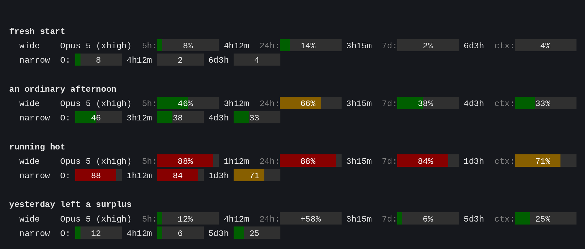
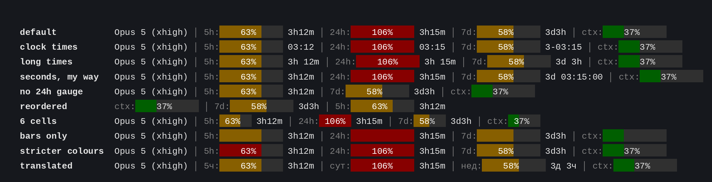

# pacebar

A status line for [Claude Code](https://claude.com/claude-code): rate-limit
gauges, a gauge for today's pace through the weekly window, and a narrow layout
that fits a phone. It works as shipped — no config file, nothing to fill in —
and every label, width, colour and format can be changed when you want it.

```
Opus 5 low │ 5h:▓▓▓▓46%░░░░░ 3h12m │ 24h:▓▓▓▓66%▓░░░░ 3h15m │ 7d:▓▓▓▓38%░░░░░ 4d3h │ ctx:▓▓▓▓33%░░░░░
```

Filled cells (`▓`) carry the colour: green below 50%, amber to 80%, red above.
Markdown cannot show that, so:



## Today, not just the week

Claude Code reports two windows, 5-hour and 7-day. The weekly number alone says
little: 50% on Monday is trouble, 50% on Friday is fine.

pacebar adds a gauge for **today**. The week is seven equal days worth 100/7 %
each, counted from the start of the weekly window rather than local midnight:

```
today% = 7 × week% − 100 × whole_days_elapsed
```

| Reads | Means |
|---|---|
| `40%` | under half of today's share spent |
| `100%` | on pace |
| `164%` | past today's share — borrowing from tomorrow |
| `+58%` | empty gauge: yesterday underspent, today starts with a surplus |

In the line at the top, `7d` sits at 38% and `24h` at 66%: the week says you are
fine, today says slow down. Only the second is worth acting on.

No history file, no daemon, no midnight rollover — it falls out of the two
numbers Claude Code already sends.

## Narrow terminals

Claude Code also runs on a phone, where 12-cell gauges with labels do not fit.
The same moment, at 80 columns:

```
O: │ ▓▓▓46░░░░ 3h12m │ ▓▓▓38░░░░ 4d3h │ ▓▓▓33░░░░
```

Every setting has a `PB_M_*` twin that replaces it below `PB_WIDE_MIN` columns.
That is the whole mechanism — no second code path. The narrow defaults drop the
24h gauge and the labels, shorten gauges to 9 cells, hide the `%` signs and cut
the model to one letter. Change any of it in one line:

```bash
PB_M_24H=on
PB_M_CTX=off
```

## Install

Needs `bash` 3.2 or newer and a 256-colour terminal.

```bash
git clone https://github.com/tavgear/claude-code-pacebar ~/.claude/pacebar
```

Then in `~/.claude/settings.json`:

```json
{
  "statusLine": { "type": "command", "command": "~/.claude/pacebar/pacebar.sh" }
}
```

That is the whole install. To update later:

```bash
git -C ~/.claude/pacebar pull
```

The next redraw picks it up, and `~/.claude/pacebar.conf` is outside the clone,
so it is left alone.

## Configuration

Optional. Copy [`pacebar.conf.example`](pacebar.conf.example) to
`~/.claude/pacebar.conf` and uncomment what you want; it is sourced as plain
bash. `PB_CONF=/path/to/file` points elsewhere. Anything left out keeps the
default shown here.



**Layout**

| Name | Default | Meaning |
|---|---|---|
| `PB_WIDE_MIN` | `125` | columns; below this the `PB_M_*` values apply |
| `PB_ORDER` | `model 5h 24h 7d ctx` | sections to print, in order |
| `PB_SEP` | `' │ '` | printed between sections; `'  '` for plain spaces |
| `PB_MODEL` `PB_5H` `PB_24H` `PB_7D` `PB_CTX` | `on` | `on`/`off` per section |

**Model**

| Name | Default | Meaning |
|---|---|---|
| `PB_MODEL_FMT` | `%n %e` | `%n` name, `%e` effort level; e.g. `'%n · %e'` |
| `PB_MODEL_SHORT` | `off` | `on` → a single letter: `O`, `S`, `H` |
| `PB_MODEL_STRIP` | `on` | drop a trailing parenthetical: `Opus 5 (1M)` → `Opus 5` |

**Gauges** — `X` is `5H`, `24H`, `7D` or `CTX`

| Name | Default | Meaning |
|---|---|---|
| `PB_X_LABEL` | `5h:` `24h:` `7d:` `ctx:` | printed verbatim; empty for none |
| `PB_X_WIDTH` | `12` | cells |
| `PB_X_PCT` | `pct` | `pct` → `46%`, `num` → `46`, `off` → nothing |
| `PB_X_LEFT` | `on`, `off` for `CTX` | `on`/`off`: time until the window resets |
| `PB_X_WARN` | `50` | amber from here |
| `PB_X_CRIT` | `80` | red from here |

**Colours** — 256-colour palette indices

| Name | Default | Meaning |
|---|---|---|
| `PB_COLOR_OK` / `_WARN` / `_CRIT` | `22` / `94` / `88` | fill, by severity |
| `PB_COLOR_EMPTY` | `236` | unfilled cells |
| `PB_COLOR_TEXT` / `_TEXT_EMPTY` | `97` / `37` | caption over filled / unfilled cells |
| `PB_COLOR_DIM` | `90` | labels and the separator |

## Time formats

One template per magnitude, so the leading zero unit drops out by itself.

| Name | Applies when | `compact` | `clock` | `long` |
|---|---|---|---|---|
| `PB_TIME_D` | ≥ 1 day | `%dd%hh` → `3d4h` | `%d-%H:%M` → `3-04:56` | `%dd %hh` → `3d 4h` |
| `PB_TIME_H` | < 1 day | `%hh%mm` → `4h56m` | `%H:%M` → `04:56` | `%hh %mm` → `4h 56m` |
| `PB_TIME_M` | < 1 hour | `%mm` → `56m` | `00:%M` → `00:56` | `%mm` → `56m` |

`PB_TIME_PRESET` (default `compact`) fills all three; an explicit template wins
over the preset.

| Specifier | | Specifier | |
|---|---|---|---|
| `%d` | days | `%tH` | total hours |
| `%h` `%H` | hours in day, plain / zero-padded | `%tM` | total minutes |
| `%m` `%M` | minutes in hour, plain / zero-padded | `%tS` | total seconds |
| `%s` `%S` | seconds in minute, plain / zero-padded | `%%` | a literal `%` |

So `PB_TIME_M='%m:%S'` gives `56:07`, and `PB_TIME_D='%dd %hh %mm'` gives `3d 4h 56m`.

## Preview

The gauges are easier to tune against numbers you do not have yet:

```bash
./preview.sh              # a gallery of typical states
./preview.sh 42 55 30     # your own 5h / week / context numbers
./preview.sh --configs    # the same numbers under different settings
```

`./pacebar.sh --version` prints the version.

## Input

`pacebar.sh` reads Claude Code's status-line JSON on stdin and prints one line.
A section whose field is absent is skipped.

| Field | Feeds |
|---|---|
| `.model.display_name` | model name |
| `.effort.level` | effort level |
| `.rate_limits.five_hour.used_percentage`, `.resets_at` | 5h gauge |
| `.rate_limits.seven_day.used_percentage`, `.resets_at` | 7d gauge, and all of the 24h gauge |
| `.context_window.used_percentage` | ctx gauge |
| `$COLUMNS` | wide or narrow layout |

## License

[MIT](LICENSE)
